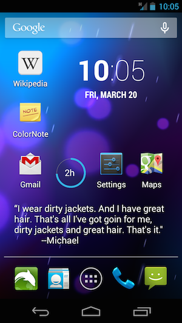
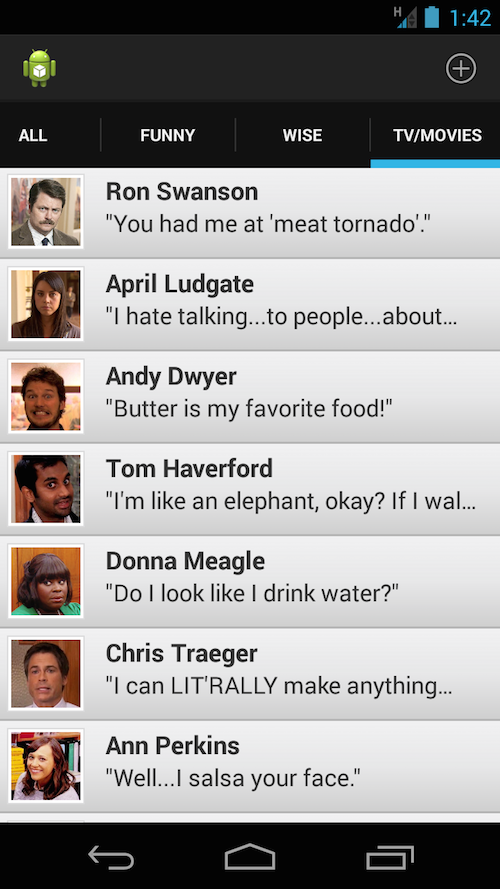

# Quote Capture

#### A virtual quoteboard for Android
Quote Capture is an app that allows users to store quotes they like and display them via a homescreen widget. Clicking the widget opens up the user's "quote library" to which new quotes can be added. To put it bluntly: this is the place to keep the ridiculous and hilarious things your friends say.

There are many apps that have a library of quotes from Mother Teresa, Steve Jobs, and other inspiring people. But this is a place for the everyday quote. For out-of-content phrases, memorable lines from TV, or that one eccentric member of your family. Future functionality will include the option to make the widget automatically display a random quote each day.

  

####Current Version
As of now, the actual functioning app/widget(left) is a separate app from the ListView app(right). These were originally created as two separate apps; the goal is the integrate the UI from the ListView app into the Quote Capture app.

Currently allows users to add a quote to their library and set it to display as the homescreen widget.

Only functions on Android devices. Sorry, Macintosh.

####Future Functionality

  - Allow user to auto-update widget with "shuffle" setting to display a random quote each day
  - Tag quote with a category (effectively making quote "playlists")
  - Upload profile photo for each quote from Contacts or Gallery
  - Share quotes via social media
